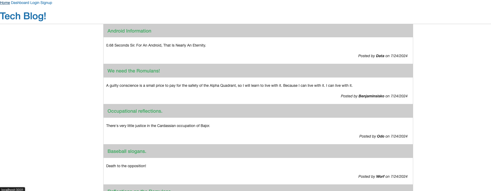

# HW14-Tech-Blog

## Description

The Tech Blog is a CMS-style platform crafted for developers to share blog entries and insights. Developed using MVC architecture, it utilizes Handlebars.js for templating, Sequelize for ORM, and express-session for authentication. Hosted on Render, it enables developers to engage through posts and comments.

## Features

* Authentication and session handling.
* Users can create, edit, and delete their posts.
* Commenting on posts from other users.
* Dashboard to manage posts.
* Responsive design with Handlebars templates.

## Installation

To install the application, follow these steps:
1. Clone the repository to your local machine with git clone.
2. Install necessary dependencies using npm install.
3. Create a .env file containing these variables:
* DB_NAME='your_database_name'
* DB_USER='your_database_username'
* DB_PASSWORD='your_database_password'

## Usage

1. Launch the application with `npm start`.
2. Visit `http://localhost:3001` in your web browser.
3. Sign up or log in to your account.
4. Click "New Post" to create a blog entry.
5. Use "Edit" or "Delete" to manage your posts.
6. Click "Comment" to add remarks to a blog entry.

## Technologies Used

* Node.js
* Express.js
* Handlebars.js
* Mysql2
* Sequelize.js
* bcrypt.js
* Render.com
* dotenv
* express-session

## Screenshots

 

## License

This project is licensed under the MIT License. 

## Contributing

Contributions are welcome! If you'd like to contribute, please fork the repository, make your changes